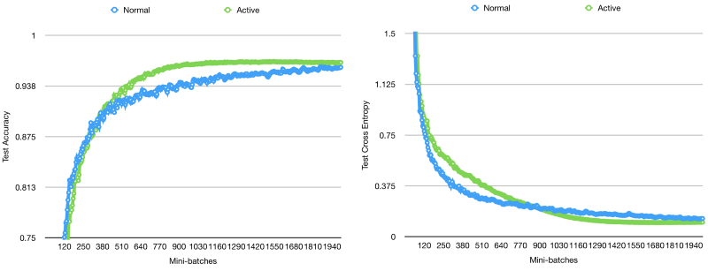
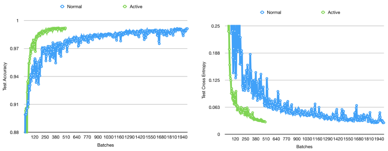
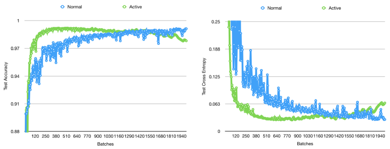
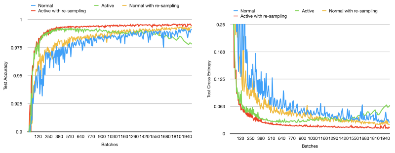
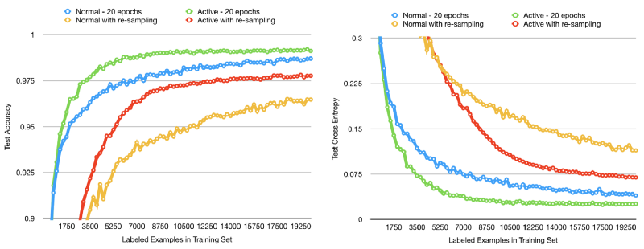
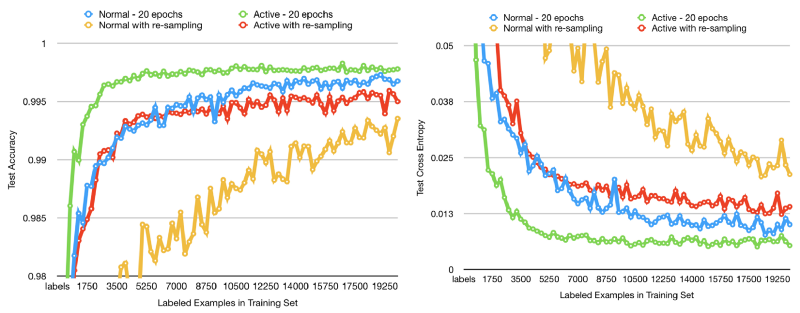
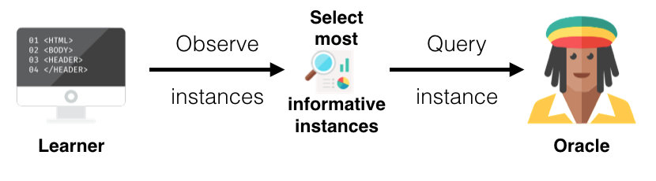

## 主动学习（Active Learning）

在过去，我们需要搜集大量的数据，并且利用专家标注这些数据，标注的越多，越准确，我们的训练集越优秀，那么我们的预测准确率就会越高，这种方式叫作被动学习（Passive Learning）。缺点是需要花费大量人力物力来寻找优秀的数据。

而主动学习（Active Learning）则为了解决这个缺陷而生，它一开始只寻找少量数据，这些少量数据是样本集合中最令人头疼的数据，也是区分类别最重要的指示，将这些小数据交给专家来标注后，训练新的模型，再寻找更令人头疼的但很重要的数据，如此重复。这样的做法可以极大地节省专家标注的数据量以及我们训练的时间。

#### MNIST 数据集下的模拟主动学习与非主动学习的对比



可以看出当数据有偏时，主动学习可以挑选更重要的样本来学习到更好的模型。


但是当继续训练时，数据较少的样本不再出现，则准确率会下降。


为了解决较少的问题，于是采用重采样来使得已出现的数据和新数据混合出现。



在多轮epoches的情况下，主动学习表现出明显的优势


也因为在多轮epoches下，重采样不占据优势。


#### 主动学习流程



 1. 获取数据（Gather data）
	 获取大量的未标注数据
 2. 分离数据（Split data into seed and unlabelled data）
	 初始我们需要一个可用的基本模型，所以我们需要先把数据分离成一部分需要标注的种子数据，以便训练一个初始模型。另一部大量的未标注数据将会被用来做主动学习。
 3. 训练模型（Train the model）
	 利用种子数据训练初始模型。
 4. 筛选未标注数据（Choose unlabelled instances）
	 我们需要利用某些方法来挑选信息量最高或是最令人迷惑的数据作为主动学习的数据，提供给专家标注，标注后加入模型训练。
 5. 设定停止指标（Stopping criteria）
	 对于第三步和第四步，我们需要反复迭代更新模型，我们可以设定一个停止指标来决定何时我们可以停止迭代更新模型。比如设定一个训练的轮次，或者利用验证集和测试集来衡量模型效果并决定何时停止训练。


#### 主动学习的方法

 1. 基于人类反馈（Human Feedback）
	 极大地改善用极少的样本构建模型的效果
 2. 半监督和迁移学习（Semi-supervised and Transfer Learning）
	 改善学习过程和增广稀少的已标注数据
	- 半监督学习
	- 迁移学习

主动学习算法的核心问题是：设计一个精准策略去查询未标注数据。

查询策略：
 - 基于异质数据的模型：数据样本来源于数据不相似程度高的区域
	 - uncertainty sampling
	For binary classifer
	```mathjax!
	$$En(\bar{X}) = \sum_{i=1}^{k} ||p_i - 0.5||$$ 
	```
	For  k classes （其实就是 Entropy 公式）
	```mathjax!
	$$En(\bar{X}) = -\sum_{i=1}^{k} p_i·log(p_i)$$ 
	```
	Gini-index 基尼系数
	```mathjax!
	$$G(\bar{X}) = 1-\sum_{i=1}^{k} p_i^2$$ 
	```
	由于有些数据的分布不平衡，有些类别数据少，有些多，所以需要做一个权衡，添加一个权重系数`!$w_i$`，这个权重由数据的占比生成，以后替换成`!$p_i·w_i$`。
	 - query-by-committtee
	 - expected model change
 - 基于性能的模型：直接衡量误差或者方差的减少
 - 基于表征的模型：试图创建一组数据能直接表征类别的核心特征
	 - density-based model

#### 如何选择样本？

